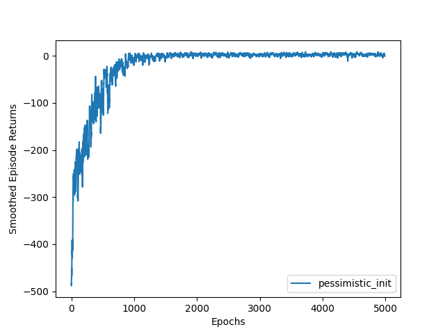
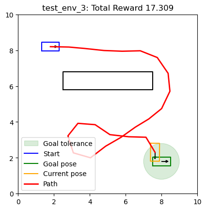

# CS440 MP5 — Reinforcement Learning

Two reinforcement learning agents built from scratch in NumPy — no PyTorch, no RL library — for
UIUC CS440 (Artificial Intelligence).

The task: teach an agent to act well in an environment it is never given a model of. It only sees
states, picks actions, and receives rewards. Part III solves a small discrete problem with a
Q-table. Part IV drops the table entirely — the state space is continuous, so the agent has to
*generalize* from hand-designed features, learning to steer a car with noisy controls around
obstacles it perceives only through a 16-beam lidar.

| | Environment | Result |
| --- | --- | --- |
| **Part III** | `Taxi-v3` — 500 states, 6 actions | **1000/1000 episodes solved**, mean return **7.87**, 13.1 steps per episode |
| **Part IV** | Dubins car — continuous poses, obstacles, stochastic controls | **4/5 test environments solved**, mean return **+17.6** on solved runs |

### Part III — a near-optimal taxi driver

Tabular Q-learning with epsilon-greedy exploration converges from an average return near −490 to
roughly optimal within ~1500 episodes:

<p align="center"></p>

The saved `QAgent_weights.npy` policy, evaluated greedily (`epsilon=0.0`) on 1000 episodes with
seeds 0–999, **delivers every passenger — 1000/1000, no failures, no timeouts** — averaging 7.87
return over 13.1 steps. Taxi's optimal average sits just under 8, so the learned policy is
essentially optimal.

### Part IV — a car that learns to steer around obstacles

With no Q-table available, `Q(s, a) = φ(s) · w_a` is learned over a 24-dimensional feature vector
(goal geometry, heading error, and 16 lidar returns) using a replay buffer and periodically-frozen
target weights. The car sees the world only through those features and drives with noisy controls:

<p align="center"></p>

Starting at the upper left, the learned policy loops around the wall obstacle and parks inside the
goal tolerance in 22 steps for a return of +17.31 — despite the fact that every control it issues
is perturbed by noise before the environment applies it.

The best checkpoint (`run_19`, shipped as `template/linear_dqn_weights.npy`) reaches the goal in
**4 of the 5 held-out test environments**, scoring +17.76, +17.75, +17.31 and +17.45 with no
truncated episodes; only `test_env_5` ends in a collision. This came out of a 21-run
hyperparameter and feature-design sweep, all of it preserved under
[template/results/](template/results/).

---

The two agents, in short:

1. **Tabular Q-learning** on Gymnasium's `Taxi-v3`.
2. **Linear DQN** (linear function approximation + replay buffer + target weights) driving a
   Dubins car through a 2D workspace with obstacles and lidar observations.

Full assignment write-up: [docs/instructions.md](docs/instructions.md) (rendered:
[docs/instructions.html](docs/instructions.html)).

## Layout

```
docs/                        assignment instructions and figures
template/
  tabular_q_learning.py      Part III — QAgent, training loop, greedy evaluation
  linear_dqn.py              Part IV — LinearDQNAgent, training/testing CLI
  gym_robot.py               Dubins-car Gymnasium env: dynamics, lidar, rewards, features
  robot.py                   unicycle dynamics + DubinsCarParams
  cspace.py                  configuration space, collision checking, rendering
  data/                      train_env_*.json / test_env_*.json environment definitions
  results/run_N/             per-run weights, path plots, test_results.json
  QAgent_weights.npy         trained Taxi Q-table (500 x 6)
  linear_dqn_weights.npy     trained Dubins weights (24 features x 3 actions)
```

## Setup

```bash
cd template
pip install -r requirements.txt      # numpy, matplotlib, gymnasium, shapely
```

## Part III — Tabular Q-learning (Taxi-v3)

`Taxi-v3` has 500 discrete states and 6 actions. [tabular_q_learning.py](template/tabular_q_learning.py)
implements:

- `QAgent.act` — epsilon-greedy selection (`np.argmax` tie-breaking).
- `QAgent.update` — `Q(s,a) += alpha * (target - Q(s,a))`, with `target = reward` on terminal
  transitions and `reward + gamma * max_a' Q(s',a')` otherwise.
- `train_agent` / `eval_agent` — episode rollouts until `terminated or truncated`; evaluation runs
  greedily with `epsilon=0.0`.

Run it:

```bash
python tabular_q_learning.py
```

This runs the `pessimistic_init` experiment defined in `__main__` (5000 epochs, `alpha=0.1`,
`gamma=0.99`, `epsilon=0.1`, `init_val=0`), saves `QAgent_weights.npy`, and plots a 10-episode
moving average of returns. Edit the `experiments` dict to sweep hyperparameters — each entry is
plotted as its own curve.

## Part IV — Linear DQN (Dubins car)

### The environment

`GymDubinsCar` in [gym_robot.py](template/gym_robot.py) is registered as `CS440DubinsCar-v0` and
built from a JSON file.

- **Actions** (3, discrete): turn left, go straight, turn right — all at fixed velocity, with
  uniform noise (`ACTION_NOISE_MAGNITUDE = 0.1`) added to the control and clipped to the robot's
  control bounds.
- **Dynamics**: unicycle model integrated at resolution `dt`, with collision checking at every
  intermediate pose (rectangular robot vs. polygonal obstacles, via `shapely`).
- **Rewards**: `-30` on collision (episode ends), `+10` on reaching the goal, otherwise shaped by
  progress — `prev_goal_dist - next_goal_dist`.
- **Termination**: collision or goal (`terminated`); 30 steps (`truncated`).
- **Observation** — the 24-dim feature vector from `make_observation`:
  `sin θ`, `cos θ`, `goal_dx`, `goal_dy`, `goal_distance`, `min lidar range`,
  `sin`/`cos` of the heading error to the goal, plus 16 lidar beam distances raycast against the
  boundary and obstacle edges.

The goal test is 2D: the car succeeds when it is within `goal_tolerance` of the goal *position*;
the goal heading is drawn but ignored.

### The agent

`LinearDQNAgent` in [linear_dqn.py](template/linear_dqn.py) keeps a weight matrix of shape
`(num_features, num_actions)`, so `Q(s, a) = φ(s) · w_a`. Updates use a replay buffer (default cap
50000) sampled in minibatches, bootstrap targets from a periodically-copied `target_weights`
(default every 100 updates), and apply a per-action linear gradient step. Exploration decays
linearly from `epsilon_start` to `epsilon_end` over `epsilon_decay_steps` episodes.

### Training and testing

```bash
# train on every data/train_env_*.json, then evaluate on every data/test_env_*.json
python linear_dqn.py --num_episodes 20000 --learning_rate 0.001 --discount_factor 0.95

# evaluate saved weights without training
python linear_dqn.py --test_only --weights_file linear_dqn_weights.npy

# continue training from saved weights
python linear_dqn.py --resume_training --weights_file results/run_19/linear_dqn_weights.npy
```

Each invocation writes to a fresh `results/run_N/` directory (or `--results_dir`): a path plot per
test environment, `test_results.json`, and the trained `linear_dqn_weights.npy`. A summary prints
to stdout:

```
Test summary: 4/5 successful episodes
Mean reward: 8.442, Mean steps: 15.2, Truncated episodes: 0
```

Main flags: `--num_episodes`, `--epsilon_start`, `--epsilon_end`, `--epsilon_decay_steps`,
`--target_weights_update_freq`, `--max_buffer_size`, `--learning_rate`, `--discount_factor`,
`--batch_size`, `--test_only`, `--resume_training`, `--weights_file`, `--results_dir`.

### Environment JSON format

```jsonc
{
  "start": [1.5, 1.5, 0.0],        // x, y, theta
  "goal":  [8.5, 8.5, 0.0],        // heading ignored by the goal test
  "robot_width": 1.0, "robot_height": 0.5,
  "velocity": 1.0, "turn_rate": 1.0,
  "control_duration": 1.0,          // seconds per action
  "dt": 0.1,                        // integration / collision-check resolution
  "goal_tolerance": 1.0,
  "boundary": {"x_min": 0, "x_max": 10, "y_min": 0, "y_max": 10},
  "obstacles": [ [[x1,y1], [x2,y2], ...] ]   // CCW polygon vertices
}
```

`data/` ships 5 test environments and 6 hand-made training environments; add more
`train_env_*.json` files to broaden training.

## Full run history

Every Dubins training run is kept under `template/results/`. Success counts over the 5 visible test
environments:

| Run | Goals reached | Mean reward |
| --- | --- | --- |
| run_19 | 4/5 | 8.44 |
| run_4, run_6, run_7, run_8 | 4/5 | 8.14 |
| run_2, run_5, run_11, run_12, run_18 | 3/5 | −0.8 … −0.4 |
| others | 0–2/5 | negative |

`template/linear_dqn_weights.npy` is the run_19 checkpoint (the best of the sweep). Runs 13, 14,
15 and 20 hold plots only — they were interrupted before `test_results.json` was written.

The Taxi headline number is reproducible from the saved Q-table:

```bash
cd template && python -c "
import numpy as np, gymnasium as gym
q = np.load('QAgent_weights.npy'); env = gym.make('Taxi-v3')
R = []
for i in range(1000):
    s, _ = env.reset(seed=i); tot = 0; done = False
    while not done:
        s, r, t, tr, _ = env.step(int(np.argmax(q[s]))); tot += r; done = t or tr
    R.append(tot)
print(len(R), 'episodes, mean return %.2f, min %d' % (np.mean(R), min(R)))
"
# 1000 episodes, mean return 7.87, min 3
```

## Notes

- `train()` accepts an `output_path` argument but does not currently save a training-returns plot;
  it returns the per-episode rewards list instead.
- Absolute paths recorded in older `results/*/test_results.json` files point at a previous location
  of this repository.
