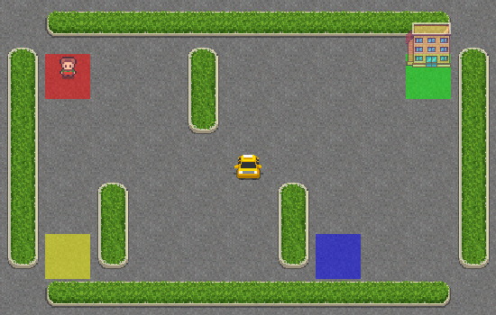
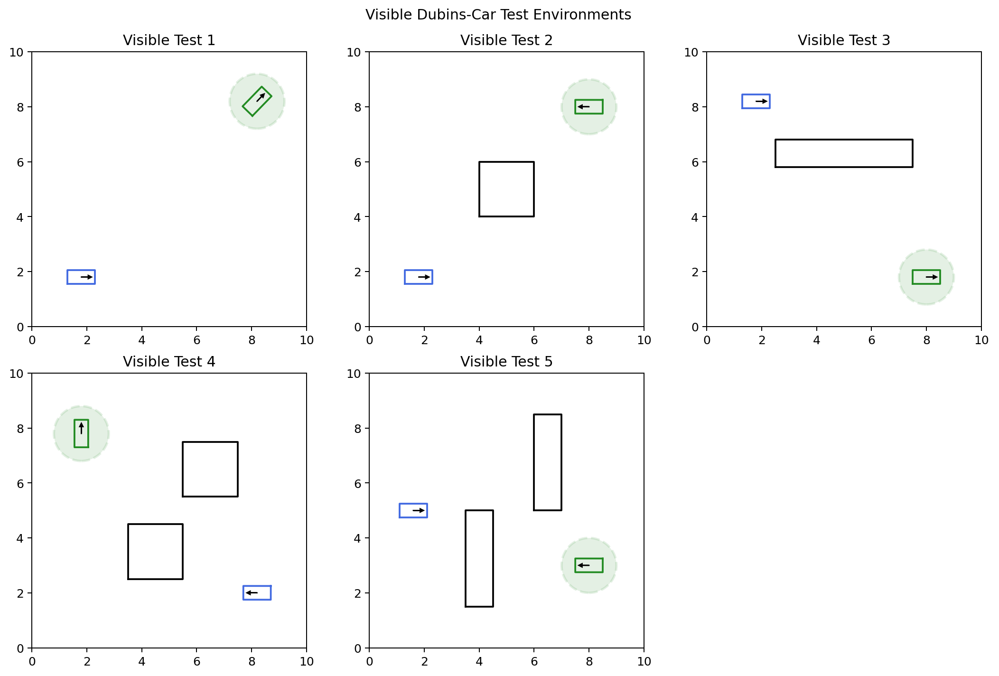
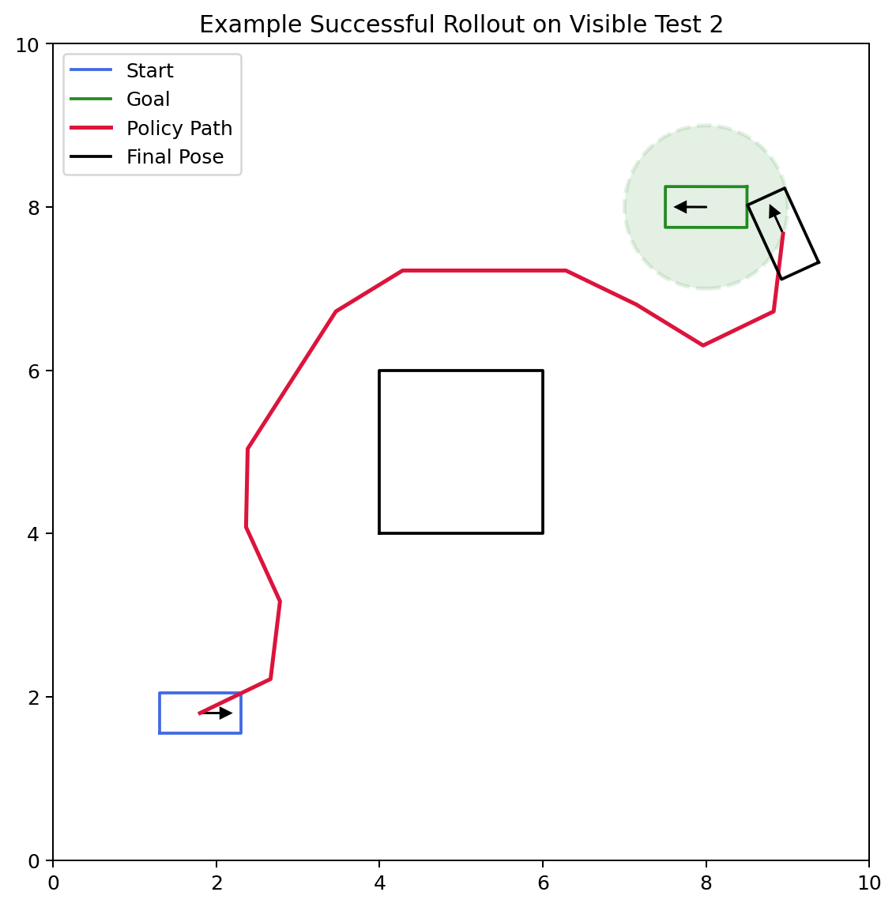
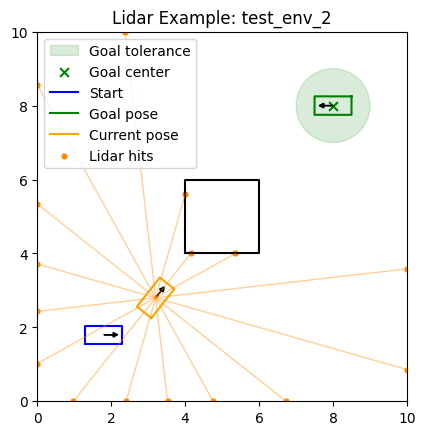
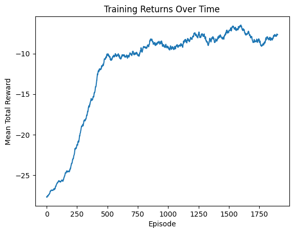

# CS440 Online Spring 2026, MP 5: Reinforcement Learning
## Due: Sunday, April 19th, 11:59pm

## I. Overview

In this MP you will implement:

1. Tabular Q-learning for a small discrete environment
2. A linear DQN agent for a Dubins car environment

As in the earlier MPs, a lot of code is already provided for you. Your job is to fill in the missing learning logic and, for the Dubins car part, design a useful hand-crafted feature representation.

## II. Getting Started

Look inside the `template/` directory for the starter code. You will find:

Dependencies (namely `gymnasium` is the new one) to be installed:

```bash
pip install -r requirements.txt
```

Files relevant to Part III:

* `tabular_q_learning.py` - you will edit and submit this

Files relevant to Part IV:

* `linear_dqn.py` - you will edit and submit this
* `gym_robot.py` - you will edit and submit this
* `cspace.py` - no need to copy from MP3, we provide it for you
* `robot.py` - no need to copy from MP3, we provide it for you
* `data/` - here you will define JSON files for training your Linear DQN agent, we provide a small test set to get you started

Please submit:

* `tabular_q_learning.py`
* `gym_robot.py`
* `linear_dqn.py`
* `QAgent_weights.npy` - trained Q-table for the Taxi environment
* `linear_dqn_weights.npy` - trained weight matrix for the linear DQN agent

## III. Tabular Q Learning (50 points)

In this part you will implement tabular Q-learning for the [Gymnasium Taxi-v3 environment](https://gymnasium.farama.org/environments/toy_text/taxi/).

You will find `TODO(III)` markers in `tabular_q_learning.py`. The main tasks are:

* initialize the Q-table
* implement epsilon-greedy action selection
* implement the Q-learning update
* implement the training loop
* optionally implement a separate greedy evaluation helper

You will be graded on:

* the correctness of `QAgent.update(...)`
* the performance of the learned policy stored in `QAgent_weights.npy`

That means you are free to tune hyperparameters such as `alpha`, `gamma`, `epsilon`, and `init_val`.

To run the code in this part you will need to directly modify the `main` block in `tabular_q_learning.py` to call your training and evaluation functions. We provide an example of how to set up your experiments but you are free to (and should) modify it as you see fit. You can also add additional helper functions and classes as needed.

### The Taxi Environment

<figure align="center">
    
    <figcaption align="center"><b>Taxi-v3 example render with the taxi near the center of the map, the passenger at `R` (the red tile), and the destination at `G` (the green tile).
</b></figcaption>
</figure>

We highly recommend that you read through the official Taxi environment documentation to understand the details of the environment. Here we provide a brief summary.

Taxi-v3 is a small gridworld in which a taxi must:

1. drive to the passenger,
2. pick the passenger up,
3. drive to the passenger's destination, and
4. drop the passenger off.

The environment is small enough that a simple tabular method works very well.

The image above can be rendered using `env.render()` after you create the environment with `render_mode="rgb_array"`. For simpler debugging in terminal the environment also supports an ASCII render that looks something like:

```text
+---------+
|R: | : :G|
| : | : : |
| : : T : |
| | : | : |
|Y| : |B: |
+---------+
```

### Spaces, Actions, Rewards, and Episodes

Each Gym environment provides 

* `env.observation_space`
* `env.action_space`

For Taxi-v3:

* observation space: `Discrete(500)`
  * `env.observation_space.n == 500`
* action space: `Discrete(6)`
  * `env.action_space.n == 6`

The six actions are:

* `0`: move south
* `1`: move north
* `2`: move east
* `3`: move west
* `4`: pick up passenger
* `5`: drop off passenger

Reward structure:

* `-1` for a normal step
* `+20` for a successful drop-off
* `-10` for illegal pickup/drop-off actions

Episode end conditions:

* `terminated=True` when the passenger is successfully dropped off
* `truncated=True` if the environment time limit is reached

When training, stop an episode when:

```python
done = terminated or truncated
```

but when updating the Q-table, only use `terminated` to determine whether to bootstrap or only use the current rewards.

### What the Observation Means

The Taxi observation is a single integer state id. You do not need to decode it into a specific state of the world since for tabular Q-learning we can use it directly as the row index into your Q-table.

### The Gym API

The basic loop is:

```python
state, info = env.reset()
next_state, reward, terminated, truncated, info = env.step(action)
```


The official Taxi docs mention action masking in `info`. Feel free to play around with it, though it is not required for this assignment.

### What to Implement in `tabular_q_learning.py`

#### 1. `QAgent.__init__(...)`

Initialize `self.q_table` as a NumPy array with:

* shape `[n_states, n_actions]`
* dtype `float`
* all values set to `init_val`

#### 2. `QAgent.act(state, epsilon=0.0)`

Implement epsilon-greedy action selection:

* with probability `epsilon`, choose a random action
* otherwise choose the best action according to the Q_table, breaking ties with the first occurrence of the maximum value (i.e. `np.argmax` behavior)

#### 3. `QAgent.update(...)`

Implement the standard Q-learning update:

```text
target = reward                              if terminal
target = reward + gamma * max_a' Q(s', a')   otherwise

Q(s, a) <- Q(s, a) + alpha * (target - Q(s, a))
```

This is the part of Part III that is graded directly for correctness.

#### 4. `train_agent(...)`

Implement the training loop over episodes:

1. reset the environment
2. pick an action using epsilon-greedy exploration
3. call `env.step(action)`
4. update the Q-table
5. accumulate reward
6. stop when `terminated or truncated`

#### 5. `eval_agent(...)`

We recommend writing a separate greedy evaluation helper with `epsilon=0.0` since this is how we evaluate your final policy...

### Saved Weights

Submit your best trained Q-table as a NumPy file named `QAgent_weights.npy` (the code currently saves to this by default).

## IV. Linear DQN for a Dubins Car (50 points)

In this part you will implement a linear function approximator for DQN in a Dubins car environment. **Training can be slow** because we are training an agent for many timesteps across many environments, in which each step requires collision checking. **DO NOT wait until the last minute to start this part.**

In MP4 you wrote linear models of the form:
$$y = X A$$

Here you will again use a linear model, but now each action has its own weight vector:
$$ Q(s, a) = \phi(s)^T w_a $$

where:

* $\phi(s)$ is your hand-designed feature vector for state $s$
* $w_a$ is the weight vector for action $a$

Your job is to:

1. design $\phi(s)$ in `gym_robot.py`
2. implement the linear DQN code in `linear_dqn.py`
3. create your own `train_env_*.json` training environments
4. train a policy and save `linear_dqn_weights.npy`

### Environment Summary

<table align="center">
    <tr>
        <td align="center"></td>
        <td align="center"></td>
    </tr>
    <tr>
        <td align="center"><b>The 5 visible Dubins-car test environments provided for you. Notice that the actual heading of the goal is visualized but not relevant to the task. All that matters is the position of the goal and radius around it.</b></td>
        <td align="center"><b>An example successful rollout on one of the provided visible test environments. The green disk shows the goal-tolerance region. Notice that the environment actions are stochastic and therefore even with the same policy we may get a different outcome.</b></td>
    </tr>
</table>

The underlying robot is a Dubins-style car with a fixed set of three controls and stochastic transitions (noise added to these controls):

* left turn
* straight
* right turn

Each episode:

* starts from the `start` pose in the JSON file
* ends immediately on collision
* ends successfully when the car gets within `goal_tolerance` of the goal **position** (not configuration, meaning the final heading does not matter)
* truncates after `30` steps if the goal has not been reached

When writing your training loop end an episode when `done = terminated or truncated` just like in the Taxi environment. And again, when computing the DQN target, only use `terminated` to decide whether to bootstrap from the next state.


### What You Need to Implement

#### 1. `gym_robot.py`

The environment already handles:

* Dubins-car dynamics
* collision checking
* lidar ray casting
* rewards
* the fixed 3-action control set

Your main responsibility in this file is the observation function:

* define a useful feature vector in `make_observation(...)`
* use information such as the goal direction, goal distance, heading, and lidar distances
* return a **1D NumPy array** of numeric features
* keep the shape and dtype consistent across all calls to `make_observation(...)`

The `GymDubinsCar` class uses the very first observation returned by `reset()` to define `observation_space`, so consistency matters. If your first observation has a different shape from later observations, your training and evaluation code will break.

Because the Q-function is linear, feature engineering matters a lot more here than it would in a deep-network implementation. Feel free to come up with any features you think might be useful, including interaction terms between simple features and nonlinear transformations of the raw information, or any other information you want to extract from the robot state and the environment

#### 2. `linear_dqn.py`

Implement the linear DQN logic, including:

* weight initialization
* epsilon-greedy action selection
* replay buffer storage
* the DQN update using a target network and sampling from the replay buffer
* training and testing loops

Some useful type/shape expectations:

* observations are 1D NumPy arrays of features
* `self.weights` should be a 2D NumPy array of shape `[num_features, num_actions]`
* `act(...)` should return an integer action index in `[0, num_actions - 1]`

The core update is still the usual DQN target:

```text
target = reward                                     if terminated
target = reward + gamma * max_a' Q_target(s', a')   otherwise
```

but now we will update the weights of our model using a step of gradient descent on the squared TD error. In other words, think of the target as the label and the current Q value as the prediction therefore the squared loss is:

```text
td_error = (target - Q(s, a)) ** 2
```
which we can use to update the weights `w_a` for action `a`...

### Training Environments

You are expected to create your own training environments.

Create files named:

```text
data/train_env_1.json
data/train_env_2.json
...
```

The easiest workflow is:

1. copy one of the provided visible test JSON files
2. change the `start`, `goal`, and obstacle layout
3. remember to keep the robot and boundary parameters the same!

None of our hidden tests are extremely challenging but they do require a reasonable amount of training and a good feature design to pass. We recommend starting with simple environments and then gradually increasing the difficulty as you iterate on your design.

<table align="center">
    <tr>
        <td align="center"></td>
        <td align="center"></td>
    </tr>
    <tr>
        <td align="center"><b>An example lidar visualization showing the current robot pose, lidar rays, hit points, and the goal-tolerance region.</b></td>
        <td align="center"><b>Example training return curve from a run in which the initial epsilon was decayed to 0.2 after 500 iterations and then held constant for the remaining iterations.</b></td>
    </tr>
</table>

### Visible and Hidden Test Environments

We provide **5 visible test environments** in `data/test_env_1.json` through `data/test_env_5.json`.

The autograder uses:

* those same 5 visible test environments, and
* 10 additional hidden test environments

for a total of **15** test environments.

To get full credit on the linear DQN portion, your submitted policy must pass **at least 10 of the 15** test environments.

We strongly recommend that you do **not** train directly on the 5 visible test environments at first. Instead, treat them like a validation set while you iterate on:

* your feature design
* your training environments
* your hyperparameters

Naturally once you've settled on a final design you should train on the visible test environments as well before submitting...

### JSON Environment Format

Each environment JSON contains:

* `start`: initial robot configuration `[x, y, theta]`
* `goal`: goal configuration `[x, y, theta]`
* `obstacles`: workspace polygons
* robot geometry and motion parameters
* workspace boundary

The goal check only uses the goal **position** and `goal_tolerance`, but the full `goal` pose is still stored in the JSON for visualization and consistency. You should not modify the robot parameters when making new training environments, only modify the `start`, `goal`, and `obstacles` fields.

When you finish the assignment, if you want to play with a more difficult task you can add the goal heading into the reward structure in `gym_robot.py` and then use the full goal pose in your feature design as well.

### Suggested Feature Ideas

A good linear feature vector usually includes some combination of:

* distance to the goal
* whether the goal is in front of or behind the robot
* whether the goal is to the left or right of the current heading
* front / left / right clearance from lidar
* minimum obstacle clearance
* interaction terms such as "is there an obstacle within 1 meter in front of the robot AND is the goal in that direction?"

There is no single required feature set. Part of the assignment is figuring out a reasonable one.

### Saved Weights

The code runs each experiment in a new directory under `results/run_<experiment_number>`. It will save the weights as `linear_dqn_weights.npy` in that directory along with other details such as evaluation on your test environments.

## Submission Instructions

Submit:

* `tabular_q_learning.py`
* `gym_robot.py`
* `linear_dqn.py`
* `QAgent_weights.npy`
* `linear_dqn_weights.npy`

Do not forget to access Gradescope from the Launch App button in Coursera so that your grade is automatically sync'd.

## Policies

You are expected to be familiar with the general course policies, including academic integrity. This is an individual assignment and the code you submit must be your own work.
